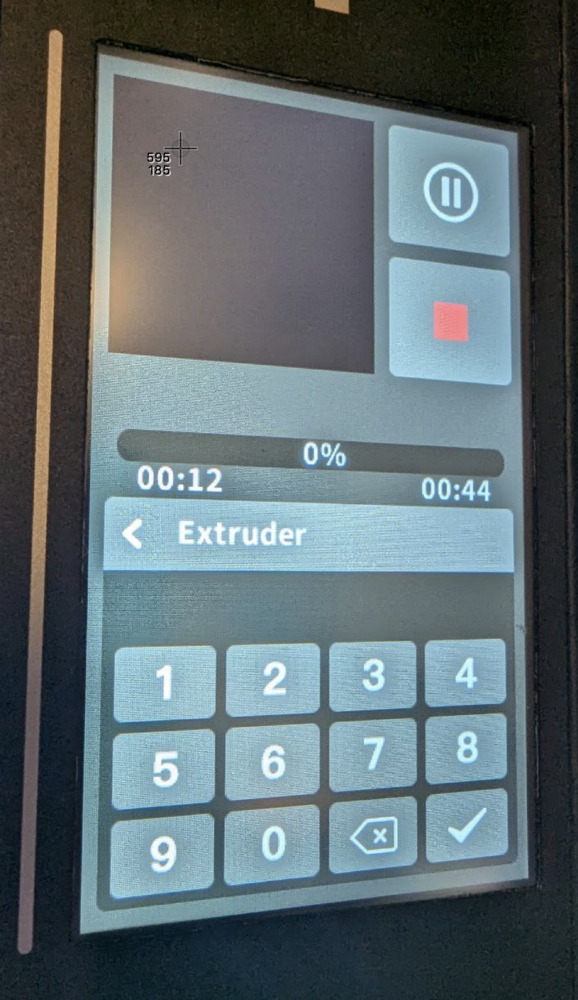

# klipmi

[Klip]per for H[MI] displays like TJC and Nextion

## Overview

`klipmi` is a framework for integrate Klipper with HMI displays such as TJC and Nextion. 
This repository contains the necessary code and configuration files to build klipper support for any UI running on a TJC or Nextion diplay

For QIDI Q1 pro with OpenQ1 https://github.com/frap129/OpenQ1.


## ADD Features

### Print Management
- [ ] Add printing page support
  - Print job status monitoring
  - Progress indication
  - Print control functions (pause/resume/cancel)
  - Fan indication

### Temperature Control
- [ ] Implement temperature management
  - Hotend temperature control
  - Bed temperature control
  - Chamber temperature control

## Screenshots


### Interface Views
| Print Status | Temperature Control |
|:------------:|:------------------:|
|  |  |


## Eddy config:

- use with: https://github.com/straga/3d_printer/tree/master/OpenQ1pro


## editor

- nextion editor: https://nextion.tech/download/nextion-setup-v1-67-1.zip
- tjc editor(): http://filedown.tjc1688.com/USARTHMI/oldapp/USARTHMIsetup_1.67.1.7z


## Features

- Handles TJC/Nextion diplay communication
- Handles interacting with moonraker
- Provides a simplified framework for interacting with both

# Supported HMIs
Currently klipmi supports:
- OpenQ1 for TJC4827X243_011

## Installation

To install `klipmi`, follow these steps:

1. Clone the repository:
    ```bash
    git clone https://github.com/straga/klipmi.git
    cd klipmi
    ```

2. Run the installation script:
    ```bash
    ./install.sh
    ```

3. Configure `klipmi` by editing the example configuration file:
    ```bash
    cp klipmi.toml.example ~/printer_data/config/klipmi.toml
`   ``
4. Get moonraker API key
    ```
    http://IP OF PRINTER/access/api_key
    ```

## Install Touch Screen Firmware

1. Stop klipmi service:
```bash
sudo systemctl stop klipmi
```

2. Install TFT Firmware:
```bash
.venv/bin/nextion-fw-upload -b 115200 -ub 921600 /dev/ttyS1 ~/klipmi/hmi/openq1/Q1_UI_mod.tft
```

## Usage

Start the service:
```bash
sudo systemctl start klipmi.service
```

Enable service startup on boot:
```bash
sudo systemctl enable klipmi.service
```

Check logs if service is not working:
```bash
sudo journalctl -xeu klipmi
```

## Troubleshooting

If you encounter the error: `No such file or directory: '/root/printer_data/config/klipmi.toml'`

1. Edit the service configuration:
```bash
sudo nano /etc/systemd/system/klipmi.service
```

2. Change the service user to `mks`

3. Restart the service:
```bash
sudo systemctl restart klipmi
```

## Contributing

Contributions are welcome! Please open an issue or submit a pull request for any changes.

## License

This project is licensed under the GPL-3.0 License. See the [LICENSE](LICENSE) file for details.

